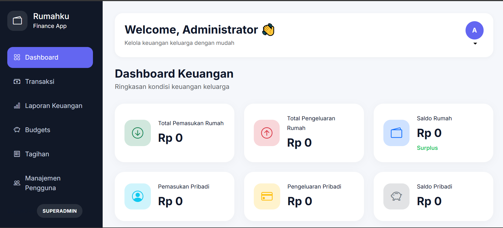
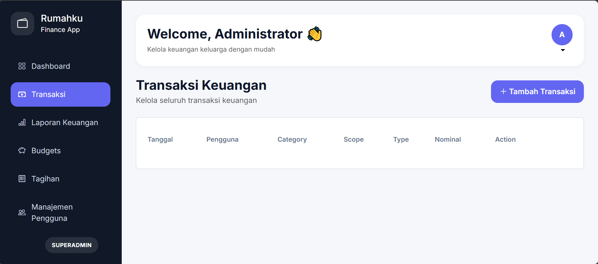
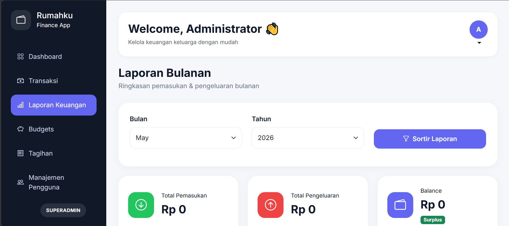
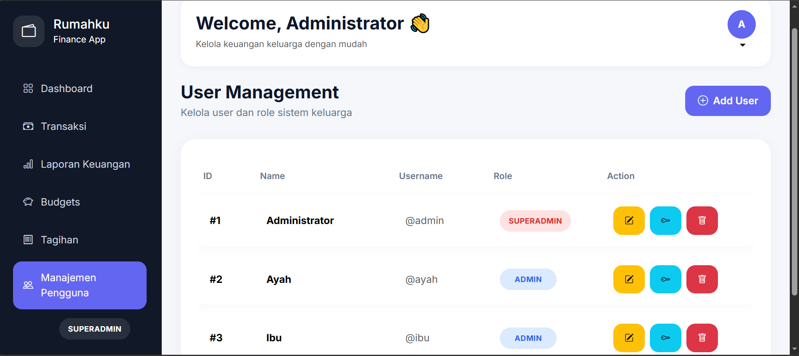

# 🏠 RumahKu - Family Finance Management System


RumahKu is an internal family financial management web application designed to help households manage transactions, budgets, bills, savings, and financial reports efficiently.

---

## ✨ Features

- 🔐 Authentication & Authorization
- 💸 Income and Expense Tracking
- 📊 Financial Dashboard
- 🧾 Bills Management
- 🎯 Budget Planning
- 📈 Monthly Financial Reports
- 👥 User Management
- 🔒 Role-based Access Control
- 📂 Transaction Categorization

---

## 🖼️ Preview

### Dashboard


### Transactions


### Reports

### Users


---

## 🛠️ Tech Stack

### Backend
- PHP 8
- CodeIgniter 4

### Frontend
- HTML5
- CSS3
- JavaScript

### Database
- MySQL

### Environment
- XAMPP

---

## 📁 Project Structure

```bash
app/
├── Controllers/
├── Models/
├── Views/
├── Filters/
├── Helpers/
├── Database/
└── Config/

public/
└── assets/
    ├── css/
    └── js/
```

---

## ⚙️ Installation

### 1. Clone Repository

```bash
git clone https://github.com/username/rumahku.git
```

### 2. Move Project

Place the project inside:

```txt
C:/xampp/htdocs/
```

### 3. Import Database

- Create a MySQL database
- Import SQL file

### 4. Configure Environment

Update database configuration in:

```txt
app/Config/Database.php
```

### 5. Run Project

Start:
- Apache
- MySQL

Open:

```txt
http://localhost/rumahku/public
```

---

## 🔐 Default Roles

| Role       | Username | Password | Access |
|------------|----------|----------|--------|
| Superadmin | admin    | admin123 | Full Access |
| User       | -     | - | Standard Features |

> Change the default password after first login for security purposes.

---

## 📌 Future Improvements

- Export PDF reports
- Data visualization charts
- Notification reminders
- Mobile responsive optimization
- REST API integration

---

## 🤝 Contribution

Contributions are welcome.

1. Fork the project
2. Create new branch
3. Commit changes
4. Push branch
5. Open Pull Request

---

## 📄 License

This project is developed for educational and internal family management purposes.
